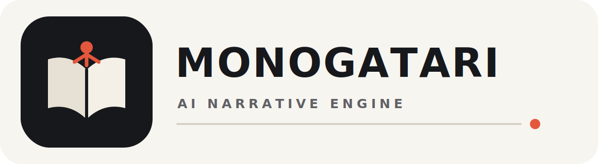

<p align="center"></p>

<p align="center">
  <a href="readme_en.md">English</a> · <a href="readme_ch.md">简体中文</a> ·
  <a href="readme_ja.md">日本語</a> · <a href="readme_ko.md">한국어</a> ·
  <a href="readme_de.md">Deutsch</a> · <a href="readme_fr.md">Français</a> ·
  <a href="readme_es.md">Español</a> · <a href="readme_ru.md">Русский</a>
</p>

# Monogatari

Monogatari는 오픈 소스 AI 네이티브 비주얼 노벨 제작 워크벤치이자 런타임입니다. 장면 안의 자유 형식 역할극과 결정론적 서사 규칙을 결합해, 생성 대화는 생생하게 유지하면서도 모델이 경로·점수·엔딩을 직접 통제하지 못하게 합니다.

> **프로젝트 상태:** v0.9.5는 활발히 개발 중입니다. 핵심 제작, 런타임, 검증, Web/PWA 및 Windows 패키징 경로는 구현되었지만, 1.0 이전에는 UI와 데이터 계약이 변경될 수 있습니다.

## 차별점

각 실시간 턴은 세 가지 책임으로 분리됩니다.

1. **NPC 생성기**는 플레이어에게 보이는 캐릭터 내 응답만 작성합니다.
2. 독립 **평가기**가 구조화된 점수와 증거 변경을 제안합니다.
3. **결정론적 상태 머신**이 제안을 검증하고 전환 또는 엔딩을 단독으로 선택합니다.

이 경계 덕분에 서사 로직을 감사할 수 있고, 설정을 보호하며, 중요한 경로를 모델 제공자 없이 재생 검증할 수 있습니다.

## 주요 기능

- 목표, Knowledge, 점수, 증거, 예산, 전환, 시간 초과 및 엔딩을 갖춘 실시간 역할극 노드.
- 캐릭터, Knowledge, 장면, 분기 대화, 워크플로, 이벤트, 엔딩, 오디오 및 설정용 시각적 편집기.
- 프롬프트 인젝션 차단, 제한된 컨텍스트, 그라운딩 검사, 저자 정의 복구 동작.
- 경로 범위, 캐릭터 안정성, 경계 조건 및 적대적 입력을 검증하는 재생 가능한 Quality Suite.
- 로컬 WebGPU 추론과 오프라인 프로젝트 자산을 지원하는 Web/PWA 배포.
- 호환 로컬 런타임 또는 생성 검증된 OpenAI 호환 서비스를 사용하는 Windows 데스크톱 패키지.
- Live2D, 2D 스프라이트, GLB/GLTF 3D 및 단계별 렌더러 폴백.
- 이식 가능한 경로와 SHA-256 인벤토리로 검증되는 `.monogatari` 패키지.
- MCP와 저장소 Skill을 통한 통제된 Agent 보조 제작.

## 처리 흐름

```text
플레이어 자유 입력
      │
      ├─ 안전성 + 그라운딩 경계
      ▼
 NPC 응답 생성기 ──► 표시 대화
      │
      ▼
 독립 평가기 ──► 점수 / 증거 제안
      │
      ▼
 결정론적 상태 머신 ──► 다음 노드 / 엔딩
```

## 빠른 시작

Node.js 20 이상, Rust stable, Tauri 2 플랫폼 필수 도구가 필요합니다. 브라우저 로컬 추론을 시험할 때만 WebGPU 지원 환경이 필요합니다.

```bash
git clone https://github.com/SakalioLabs/Monogatari.git
cd Monogatari/frontend
npm install
npm run dev
```

Windows 데스크톱 앱:

```bash
cd Monogatari/rust-engine/crates/tauri-app
cargo tauri dev
```

검증:

```bash
node scripts/verify-modules.mjs --list
node scripts/verify-modules.mjs
node scripts/verify-release.mjs
```

## 저장소 구조

| 경로 | 용도 |
|---|---|
| `frontend/` | Vue 3 + TypeScript 제작 UI, Playtest, Web/PWA |
| `rust-engine/` | Rust 런타임, 제작 경계, MCP, Tauri |
| `data/` | 기본 프로젝트와 실행 가능한 품질 픽스처 |
| `docs/` | 아키텍처, 데이터 형식, 패키징, MCP, 릴리스 문서 |
| `.agents/skills/` | Monogatari 프로젝트용 Agent 제작 워크플로 |
| `scripts/` | 모듈, 자산, 미러, 패키지 및 릴리스 검증 |

프로젝트 제작은 [`docs/DATA_FORMAT.md`](docs/DATA_FORMAT.md)에서 시작하세요. Agent 통합은 문서화된 [MCP 서버](docs/MCP_SERVER.md)와 정확한 사전 조건 트랜잭션을 사용해야 하며, 인증 정보는 프로젝트 데이터 외부에 보관해야 합니다.

## 기여 및 라이선스

Issue와 Pull Request를 환영합니다. [CONTRIBUTING.md](CONTRIBUTING.md)를 확인해 주세요. Copyright © 2026 SakalioLabs. 이 프로젝트는 허용 범위가 넓은 [MIT License](LICENSE)로 배포됩니다.
